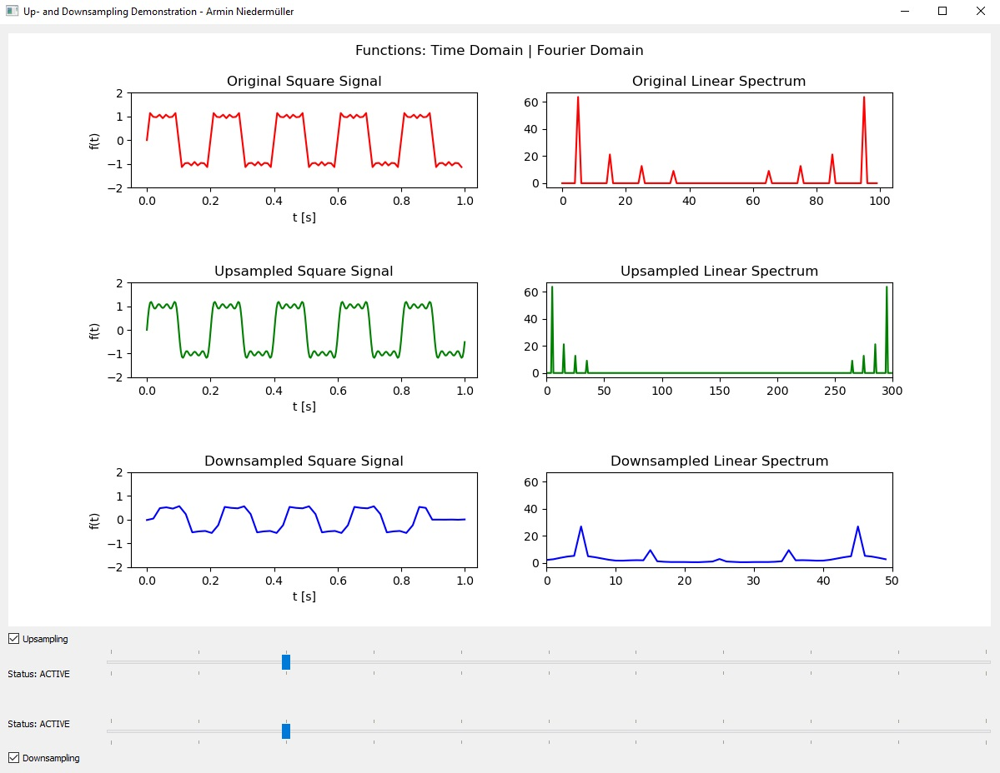

# resampling_demo
A demo Python script, which shows the effects of up-sampling/interpolation and down-sampling/decimation.

A Fourier Series Square Signal is generated.
The plot shows in the first row the original signal and its linear spectrum.
The second row shows the upsampled signal and spectrum and the third row shows the downsampled versions.

Use the slider to down- / upsample and use the checkboxes to activate down- / upsampling.

