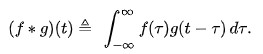
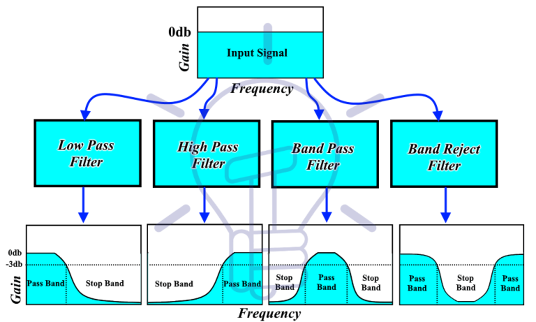
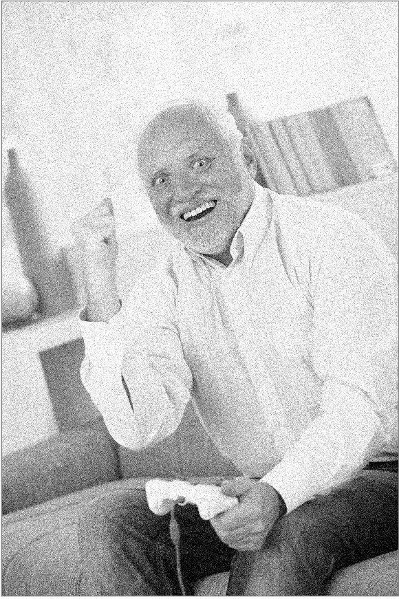
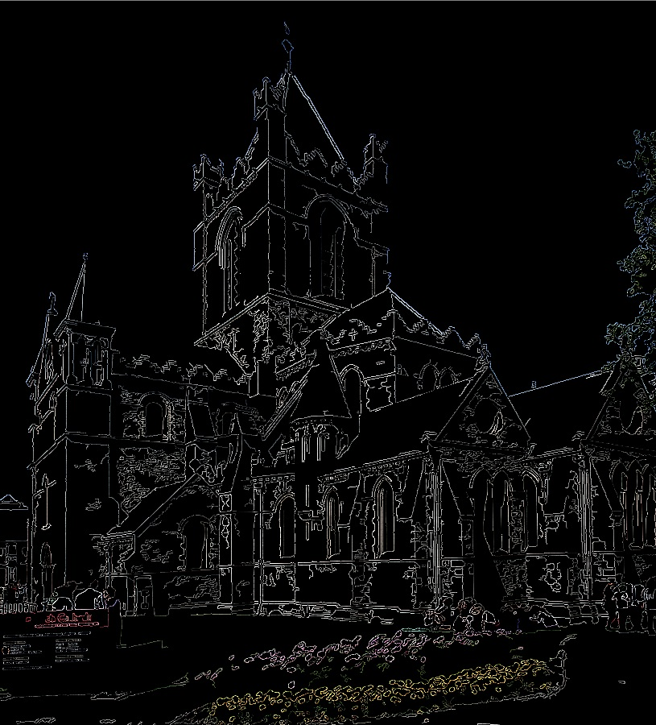
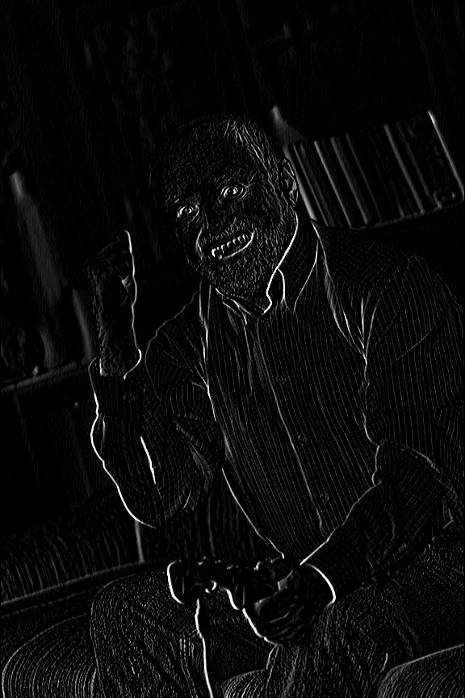
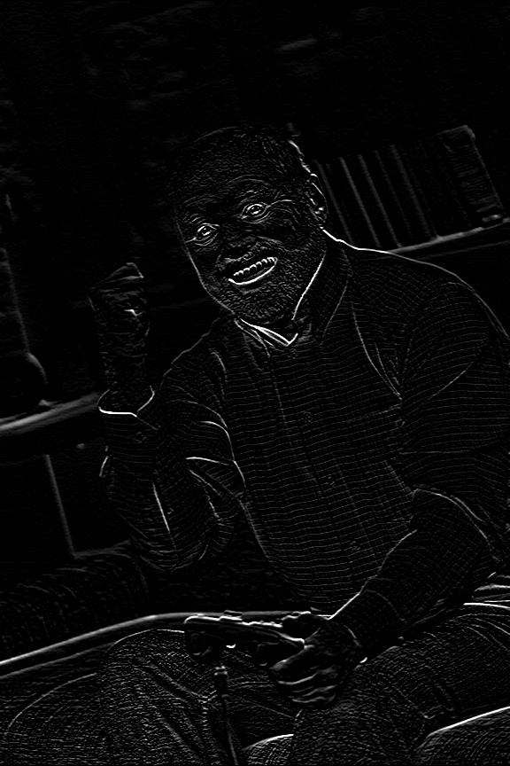
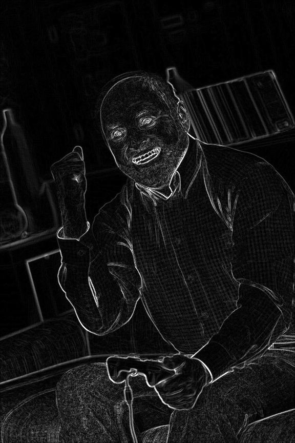
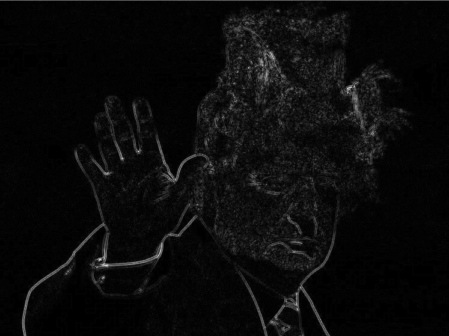
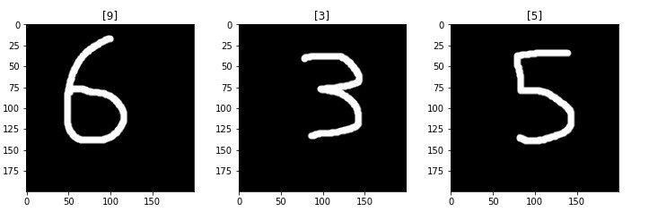
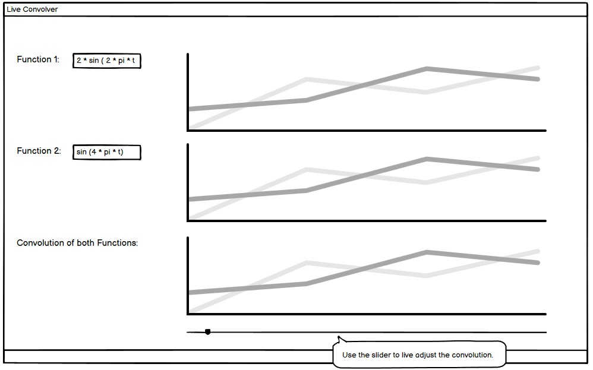

# Hardware Oriented Signal Processing
Armin Niedermueller, Ahmet Cihat Bozkurt

Using convolution for Image-Processing such as Filtering, Edge Detection. Convolutionional Neural Networks

# Introduction

The convolution f \* g is a mathematical operation on two functions f and g. The function g is mirrored on and then then shifted (both on the x-axis) over the function f.
The result of f \* g  is the value of the area between the two overlapping functions f and g at each point when shifting g over f. The following image gives an intuitive idea 
about what the convolution is doing:

Image Source: [Wikipedia - Convolution](https://en.wikipedia.org/wiki/Convolution)

The convolution formula...:\

# Applications

## Signal Filtering
What is a filter ? 

For image processing or signal processing, unwanted components or features can be suppressed by applying filters. Filters can be used for different kinds of purposes such as anti-aliasing, power supply smoothing, noise suppression, etc. Filter types can be divided into different classes based on their construction, frequency response, impulse response.  

## Based on Construction
### Passive Filter
Passive filters are designed with passive electronic components such as resistors, inductors ,and capacitors. Since electronic components are consuming energy during functioning, the energy of the input signal always less then the output signal energy in application.   
### Active Filter
In active filters, apart from passive components which are mentioned above, active components are also used such as transistors, and amplifiers. Thanks to the active filters, unwanted parts of a signal can be suppressed and rest of the signal can be impowered.
## Based on Frequency Response
Filters are mainly classified into four classes which are lowpass filter, highpass filter, bandpass filter, and band-reject filter. The following picture shows the frequency response of each type of the filter.

Image Source: [Electricaltechnology](https://www.electricaltechnology.org)

### Low Pass Filter 
Low pass filters are designed to allow frequencies which are lower than cutoff frequency and attenuate the rest. They are used in suppressing the noise, blocking high pitches in speakers, etc.
### High Pass Filter
High pass filters are designed to allow frequencies which are higher than cutoff frequency and attenuate rest. They are used in low-frequency noise reduction, audio amplifiers etc. 
### Band Pass Filter 
Bandpass filters  have upper and lower cutoff frequencies and allow frequencies that are between these cutoff frequencies and attenuate the rest. They are used in wireless transmitters and receivers
### Band Reject Filter 
Band reject filters have upper and lower cutoff frequencies like band-pass filters and attenuate the frequencies which are between the cutoff frequencies and allow the rest.This type of filter is also used in telecommunication, audio signal processing, and many more.

### FIR Filter
FIR(finite impulse response) filters don't have a feedback that's why output signal depends only on the current and previous input values. This can be seen in the given formula below.  It is called as finite impulse response because there is no feedback in the filter and this make the output signal drops to zero after some time interval. This can be observed in the figure SS. Another interesting property is FIR filters have linear phase response which means all the frequencies are shifted equally in frequency domain after filtering operation.

 
Image Source: https://en.wikipedia.org/wiki/Finite_impulse_response
  

 
Image Source: https://en.wikipedia.org/wiki/Finite_impulse_response

Here x[n] is the input signal, y[n] is the output signal, N is the filter order, b_i is the ith coefficient of filter.  

### IIR Filter
IIR(infinite impulse response) filters have feedback from output to input that's why output depends on current and previous inputs and previous outputs. The feed back can be observed in the given figure SAS. TODO: give some information about IIR filter formula. 

 
Image Source: https://technobyte.org 

## Image Processing

An digital image can be interpreted as a two dimensional signal with coordinates x,y for each Pixel P(x,y).
The brightness of the pixel P(x,y) signal is seen as the current signal value f(x,y) and x,y as the current position. 
An 2D image convolution is realized by shifting a so-called convolution kernel over an image).
Both are represented as matrices, where the kernel is smaller than the image, usually 3x3.
When shifting the kernel over the image, it performis an elementwise multiplication with the part of the iamge it is currently on.
The results of this operation are then summed up and written into a single output pixel as seen in the following images:

Image Source: https://towardsdatascience.com/intuitively-understanding-convolutions-for-deep-learning-1f6f42faee1 

The convolution in image processing can be used, amongst others, for the following fields:
### Blur / Denoising
Blurring method is generally used in the preprocessing of image to remove the noise or remove details in image. This can be done via a linear or nonlinear filter. 
#### Linear Filter : 
Mean filters are linear filters and they are used to reduce the noise in an image. This type of the filter, replace the center values with the average of the neighborhood values to decrease the sharp transition if there is.
Although it is really useful for noise removing, smoothing the image reduces the edge information which is lied inside the image, so this is a trade-off for the averaging filter.
A possible kernel is given below for averaging operation. Kernel size can be adjusted depends on the problem because definitely kernel size changes the result of the filter operation. Each of the element is 1 and at the end of the filter operation the result has to be normalized with the number of elements in the kernel.

For illustration, an averaging filter is applied to a noisy image. You can see the original, noisy, and filter result images below. 

Original Image | Image with Noise | Filtered Image
:-----------------:|:---------------:|:----:
||

#### Non-Linear Filters : 
Median filter can be an example of the nonlinear filter since its nonlinear characteristic. This type of filter, replaces the median of the kernel elements with the center pixel of the kernel. Median filter is specifically effective with salt and pepper noise because this noise occurs as a white or black points. Most of the cases, these points cause instant changes in images and replacing the median of the neighborhood of the noise pixel removes the noise pixel.  

For illustration, an median filter is applied to an image that has salt and pepper noise. You can see the original, noisy, and filter result images below. 

Original Image | Image with Noise | Filtered Image
:-----------------:|:---------------:|:----:
||

### Canny Edge Detector

The canny edge detector is used to extract structural information from images. It reduces the data amount to be processed1.
The following steps are conducted to extract edge information from an image with the canny algorithm2:
* Convolving the image with a gaussian filter kernel to filter out noise

	

* Convolution with a pair of sobel kernels in X- and Y-direction an calculate the gradient of the image

	
  
	
  
	

* Remove pixels which are not considered to be part of and edge, i.e. only thin lines will remain.
* Apply a thresholding2: 
	- If a pixel gradient is higher than the upper threshold, the pixel is accepted as an edge.
	- If a pixel gradient value is below the lower threshold, then it is rejected.
	- If the pixel gradient is between the two thresholds, then it will be accepted only if it is connected to a pixel that is above the upper threshold.

Original Image | Canny Edge Output |
:-------------:|:-----------------:|
|

### Sobel Edge Operator
Sobel edge operator is created for edge detection. Edge has big intensity difference with neighbor pixels. Edge detection is nothing but detecting the image areas where this kind of differences occur. The given figure below is explaining this definition well. There are two side in which the intensity differences can be observed by naked eyes. The figure at the middle, shows the intensity function with which white pixels are 255 and black pixels are 0. The transition between white and black creates extreme points that can be found with the first derivative. 

Image Source: http://stanford.edu/ 

In order to find the extreme values, first derivative with respect to x and y is calculated by the given two kernels below. After that gradient magnitude is calculated and orientation of the gradient is calculated by the formulas given below.

  
	
  
	
  
	

Sobel operator is applied and results are given below. 

Gx Gradient | Gy Gradient | Magnitude
:-------------:|:-----------------:|:-------------:|
||| 

### Laplace operator
While the Sobel Operator takes the first derivative of the image pixels, the Laplace Operator takes the second derivative.
On edges, the second derivative is zero. Since an image can be interpreted as a signal in 2 dimensions, the Laplacian Operator is calculated for the whole image.
Before calculating the Laplacian, a Gaussian blur is applied to remove noise3.

Original Image | Laplace Output |
:-------------:|:--------------:|
|

## Audio Processing
Audio processing is one of the sub-branch of signal processing. Audio signals are sound waves and can be represented as analog or digital signals. Digital signal processing methods can be applied to audio signals such as auto-correlation, cross-correlation, etc. Since these two methods are related to convolution, they are explained in this project.

### Auto-Correlation
Autocorrelation is the degree of similarity between a signal and a shifted version of the same signal. Therefore, what is done is exactly the same during the cross-correlation but, in auto-correlation signal is being convolved with itself. For continuous signals, auto-correlation can be applied with the given formula below.

The concept is the same as the cross-correlation if the shifted version of the signal is similar to the original signal at a certain time, then the positive value is obtained from auto-correlation.

Image Source: http://qingkaikong.blogspot.com/ 

It can be seen in the figure above, for 0 shifting the autocorrelation is 1 which is the maximum value in the graph and it goes to zero when the correlation is decreased by the time shift.  

### Cross-Correlation
Cross-correlation is the similarity measure of two different signals. This method is used in pattern recognition, signal detection, etc. For different two signals, when those two signals are similar to each other for a certain time then positive results are produced by the cross-correlation for this specific time instant. If they are totally different than each other, in this case, 0 can be obtained as a result. In order to calculate the cross-correlation for continuous signals following formula is used.

Here * donates the complex conjugate however since we will consider the real-time signals, this will not be needed in the application.

## Artificial Intelligence / Deep Learning

### Convolutional Neural Networks
A convolutional neuronal network (CNN) is a concrete case of Deep Learning neural networks5.
There are two layers that define CNNs. First, convolution and second, pooling.

#### Convolution
The main purpose of a first convolutional layer is to detect features or visual features in images such as edges, lines, color drops, etc5.
A second convolutional layer can learn patterns composed of basic elements learned in the previous layer.
And so on until it learns very complex patterns. This allows convolutional neural networks to efficiently learn increasingly complex and abstract visual concepts5.

[Source](https://towardsdatascience.com/convolutional-neural-networks-for-beginners-using-keras-and-tensorflow-2-c578f7b3bf25)

The first layer of the CNN can be a sliding window of N*N pixels which convolves over the whole image. For each sliding position, the windows gives the input to the first 
hidden layer. If the image has 28*28 pixels, the hidden layer would have 5*5 neurons which process the information later. The sliding window (or kernel) can have a size of 5*5,
this means that the window can slide 23 pixels to the right and 23 pixels to the bottom, which results in 5*5 neurons. Moreover, the kernel inherits the bias value b and Weights W. 
While sliding over the image, the neurons are computed by the scalar product of the filter kernel and the neurons.

[Source](https://towardsdatascience.com/convolutional-neural-networks-for-beginners-using-keras-and-tensorflow-2-c578f7b3bf25)

For each characteristic that should be detected, there exists a different filter kernel. A CNN therefore inherits several filters.

#### Pooling
After computing the first hidden layer, the next layer is the pooling layer. In the following example a 2*2 pooling window is sliding over the first hidden layer.
Different pooling methods exist, like taking the average of the 2*2 points and putting it into the next layer. However, max-pooling tends to work better than alternative solutions5.
The following image tries to explain the max pooling visually.
In the middle image, the 2*2 pooling windows are shown over the image, which later corresponds to the right image which only contains the max value of each 2*2 area.

[Source](https://towardsdatascience.com/convolutional-neural-networks-for-beginners-using-keras-and-tensorflow-2-c578f7b3bf25)

Each CNN contains as many pooling filters as there are convolutional filters:

[Source](https://towardsdatascience.com/convolutional-neural-networks-for-beginners-using-keras-and-tensorflow-2-c578f7b3bf25)

### Image Classification with CNNs and Tensorflow 2.0 / Keras

#### MNIST Database Digits:

Here, some own written input digits are tested:

# Showcase
A program whith a graphical user interface which allows the user to input 2 different functions.
Those functions are then displayed and their convolution is calculated and visualized.
Furthermore, the user can control the convolution with an interactive slider to better understand the process.

### Sources
1. [Canny edge detector](https://en.wikipedia.org/wiki/Canny_edge_detector)
2. [Canny edge detector - OpenCV](https://docs.opencv.org/4.2.0/da/d5c/tutorial_canny_detector.html)
3. [Laplace operator - OpenCV](https://docs.opencv.org/4.2.0/d5/db5/tutorial_laplace_operator.html)
4. [Hough line transform - OpenCV](https://docs.opencv.org/4.2.0/d9/db0/tutorial_hough_lines.html)
5. [Convolutional Neural Networks - TowardsDataScience](https://towardsdatascience.com/convolutional-neural-networks-for-beginners-using-keras-and-tensorflow-2-c578f7b3bf25)
6. [Signal Filtering](https://www.electricaltechnology.org)
7. [Blur/Denoising](https://opencv-python-tutroals.readthedocs.io/en/latest/py_tutorials/py_tutorials.html)
8. [Sobel Operator](https://docs.opencv.org/4.2.0/d2/d2c/tutorial_sobel_derivatives.html)
